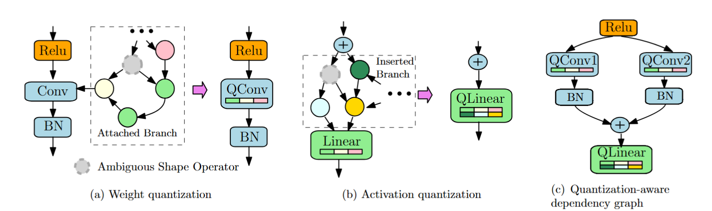

# GETA
This repo provides the implementation of **GETA**, a **G**eneric, **E**fficient **T**raining framework that **A**utomates joint structured pruning and mixed precision quantization. GETA is architecture agnostic and user-friendly. Using **GETA**, one can compress a wide range of neural network architecures including but not limited to convolutional neural networks, transformers, vision transformers, and small language models with minimal engineering efforts on the user side.

## Features
The GETA framework features two essential modules, quantization-aware dependency graph (QADG) analysis and quantization-aware structured sparse optimizer (QASSO).

* Graph Analysis. **GETA** first constructs the pruning search space that supports structured pruning. Careful computational graph optimization is introduced to handle both weight quantization and activation quantization. The following figure visualizes the general idea of how graph analysis is performed.

  

* QASSO Optimizer. **GETA** next deploys **QASSO** optimizer to figure out the tradeoff between pruning and compression given the compression constraints. QASSO is a white-box optimizer for an optimization problem with both sparisty and quantization constraints, which is formulated as
```math
\begin{aligned}
\min_{x,d,q_m,t} & f(x, d, q_m, t) \\
\text{s.t.} & \text{Card}\{g \in \mathcal{G} \mid [{x}]_g = 0 \} = K, \\
& b_i \in [b_l, b_u], \quad i \in \mathcal{L},
\end{aligned}
```
where $\mathcal{G}$ represents the set of parameter groups and $K$ represents the target sparsity ratio and $[b_l, b_u]$ specifies the target bit width range, and $\mathcal{L}$ denotes the index set of layers that have parameterized quantization layers added. By white-box, one can explicity control the sparsity level $K$ and the bit width range $[b_l, b_u]$.

## Installation
We recommend to run the framework under `pytorch>=2.0` and to use `git clone` to install.

```bash
git clone https://github.com/microsoft/geta.git
```

## Quick Start

We provide an example of framework usage. More explained details can be found in [tutorials](./tutorials/).

### Minimal usage example. 

```python
from only_train_once.quantization.quant_model import model_to_quantize_model
from only_train_once.quantization.quant_layers import QuantizationMode
from sanity_check.backends.vgg7 import vgg7_bn
from only_train_once import OTO
import torch

# Create OTO instance
model = vgg7_bn()
model = model_to_quantize_model(model, quant_mode=QuantizationMode.WEIGHT_AND_ACTIVATION)
dummy_input = torch.rand(1, 3, 32, 32)
oto = OTO(model=model.cuda(), dummy_input=dummy_input.cuda())

# Create GETA optimizer
optimizer = oto.geta(
    variant="adam",
    lr=1e-3,
    lr_quant=1e-3,
    first_momentum=0.9,
    weight_decay=1e-4,
    target_group_sparsity=0.5,
    start_projection_step=0 * len(trainloader),
    projection_periods=5,
    projection_steps=10 * len(trainloader),
    start_pruning_step=10 * len(trainloader),
    pruning_periods=5,
    pruning_steps=10 * len(trainloader),
    bit_reduction=2,
    min_bit_wt=4,
    max_bit_wt=16,
)

# Train the DNN as normal via GETA
model.train()
model.cuda()
criterion = torch.nn.CrossEntropyLoss()
for epoch in range(max_epoch):
    f_avg_val = 0.0
    for X, y in trainloader:
        X, y = X.cuda(), y.cuda()
        y_pred = model.forward(X)
        f = criterion(y_pred, y)
        optimizer.zero_grad()
        f.backward()
        optimizer.step()

# A pruned and quantized vgg7 will be generated. 
oto.construct_subnet(out_dir='./')
```

# Issues
We are adding more information to the tutorials folder. Stay tuned. Thanks for patience.

## Instructions to contributors
We would greatly appreciate the contributions in any form, such as bug fixes, new features and new tutorials, from our open-source community.

## BibTeX
If you find this repo useful for your research, please consider citing our paper:

```
@article{qu2025automatic,
  title={Automatic Joint Structured Pruning and Quantization for Efficient Neural Network Training and Compression},
  author={Qu, Xiaoyi and Aponte, David and Banbury, Colby and Robinson, Daniel P and Ding, Tianyu and Koishida, Kazuhito and Zharkov, Ilya and Chen, Tianyi},
  journal={arXiv preprint arXiv:2502.16638},
  year={2025}
}
```


